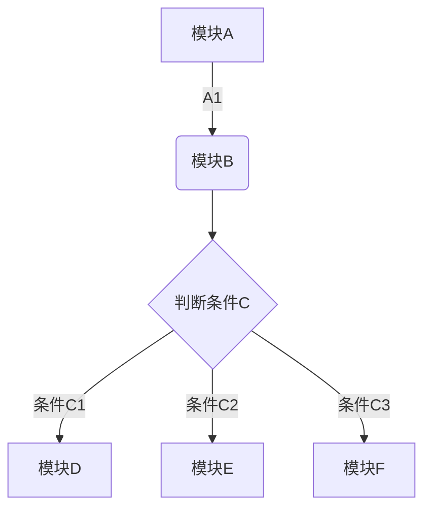
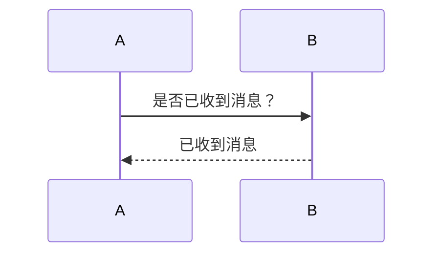

# Markdown使用教程
下载印象笔记，安装后点击文件->新建笔记->新建Markdown 笔记
## 1. 标题
#后加空格
`# ` 表示一级标题
`## `表示二级标题
`### `表示三级标题
以此类推
## 2. 字体
### 2.1 加粗
格式为`**文字**`
效果如下:

加粗
**加粗**  
### 2.2 斜体
格式为`*文字*`
效果如下:

斜体
*斜体*
### 2.3 斜体加粗
格式为`***斜体加粗***`
效果如下:

斜体加粗
***斜体加粗***
### 2.4 删除线
格式为`~~文字~~`
效果如下:

删除线
~~删除线~~
### 2.5 下划线
格式为`<u>文字</u>`
效果如下:

下划线
<u>下划线</u>
### 2.6 插入空格
markdown默认只能识别一个空格
解决方法一：
插入`&emsp;`
效果如下
空格
&emsp;空格
解决方法二：
使用全角空格
若使用搜狗输入法，点击工具箱->属性设置->高级，勾选全半角切换,即可通过shift+space切换半全角

## 3. 引用
在引用的文字前加>,支持嵌套如>>,>>>
示例
>一级引用
>这是一级
>>二级引用
>>这是二级
>>>三级引用
>>>这是三级
## 4. 分割线
使用三个或以上-或者*
示例：
`---`
`***`
`----`
`****`

---
***
----
****
## 5. 图片
语法为: ` ![text]（address "title")@w=300@h=150@w=200h=100@h=100w=200`
@设置图片大小和title可不加
示例:
``

##  6. 超链接
语法为`[name](address "title")` 
title可不加
示例:
`[百度](http://www.baidu.com)`
[百度](http://www.baidu.com)

## 7. 列表
### 7.1 无序列表
语法：
`- 列表内容`
`+ 列表内容`
`* 列表内容`
无序列表用`- + * ` 均可
效果如下：
- 列表内容
+ 列表内容
* 列表内容  
### 7.2 有序列表
语法：
数字加点

示例：
`1. 列表内容`
`2. 列表内容`
`3. 列表内容`
1. 列表内容
2. 列表内容
3. 列表内容
### 7.3 列表嵌套
语法：
上一级和下一级之间敲三个空格
无序和有序可以混用
示例：
`+ 一级无序列表`
　 ` + 二级无序列表`
+ 一级无序列表
    + 二级无序列表
    
`1. 一级有序列表`
　 `1. 二级有序列表`
1. 一级有序列表
   1. 二级有序列表
## 8. 表格

第二行分割表头和内容。
有一个就行，为了对齐，多加了几个
文字默认居左
两边加：表示文字居中
右边加：表示文字居右
注：原生的语法两边都要用 | 包起来。此处省略
示例：
```
表头|表头|表头
---|:--:|---:
内容|内容|内容
内容|内容|内容
```
表头|表头|表头
---|:--:|---:
内容|内容|内容
内容|内容|内容    
```
姓名|技能|排行
--|:--:|--:
刘备|哭|大哥
关羽|打|二哥
张飞|骂|三弟
```
姓名|技能|排行
--|:--:|--:
刘备|哭|大哥
关羽|打|二哥
张飞|骂|三弟
## 9. 代码
语法：
单行代码：代码之间分别用一个反引号包起来

代码块：代码之间分别用三个反引号包起来，且两边的反引号单独占一行
示例：
单行代码：

    `代码内容`
`代码内容`

代码块：

    ```
        代码...
        代码...
        代码...    
    ```
```
    代码...
    代码...
    代码...
```
## 10. 数学公式
示例：

    ```math
    e^{i\pi} + 1 = 0
    ```
```math
e^{i\pi} + 1 = 0
```
## 11. 流程图
    
    ```mermaid
    graph TD
    A[模块A] -->|A1| B(模块B)
    B --> C{判断条件C}
    C -->|条件C1| D[模块D]
    C -->|条件C2| E[模块E]
    C -->|条件C3| F[模块F]
    ```


## 12. 图表
    ```chart
    ,Budget,Income,Expenses,Debt
    June,5000,8000,4000,6000
    July,3000,1000,4000,3000
    Aug,5000,7000,6000,3000
    Sep,7000,2000,3000,1000
    Oct,6000,5000,4000,2000
    Nov,4000,3000,5000,

    type: pie
    title: Monthly Revenue
    x.title: Amount
    y.title: Month
    y.suffix: $
    ```
    
```chart
,Budget,Income,Expenses,Debt
June,5000,8000,4000,6000
July,3000,1000,4000,3000
Aug,5000,7000,6000,3000
Sep,7000,2000,3000,1000
Oct,6000,5000,4000,2000
Nov,4000,3000,5000,

type: pie
title: Monthly Revenue
x.title: Amount
y.title: Month
y.suffix: $
```
    ```chart
    ,Budget,Income,Expenses,Debt
    June,5000,8000,4000,6000
    July,3000,1000,4000,3000
    Aug,5000,7000,6000,3000
    Sep,7000,2000,3000,1000
    Oct,6000,5000,4000,2000
    Nov,4000,3000,5000,

    type: line
    title: Monthly Revenue
    x.title: Amount
    y.title: Month
    y.suffix: $
    ```
    
```chart
,Budget,Income,Expenses,Debt
June,5000,8000,4000,6000
July,3000,1000,4000,3000
Aug,5000,7000,6000,3000
Sep,7000,2000,3000,1000
Oct,6000,5000,4000,2000
Nov,4000,3000,5000,

type: line
title: Monthly Revenue
x.title: Amount
y.title: Month
y.suffix: $
```


## 13. 时序图

    ```mermaid
    sequenceDiagram
    A->>B: 是否已收到消息？
    B-->>A: 已收到消息
    ```

### 14. 甘特图
    ```mermaid
    gantt
    title 甘特图
    dateFormat  YYYY-MM-DD
    section 项目A
    任务1           :a1, 2018-06-06, 30d
    任务2     :after a1  , 20d
    section 项目B
    任务3      :2018-06-12  , 12d
    任务4      : 24d
    
```mermaid
gantt
title 甘特图
dateFormat  YYYY-MM-DD
section 项目A
任务1           :a1, 2018-06-06, 30d
任务2     :after a1  , 20d
section 项目B
任务3      :2018-06-12  , 12d
任务4      : 24d